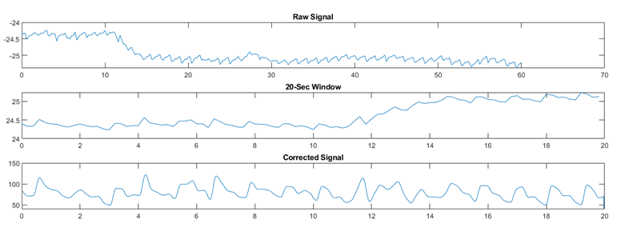

# Continuous Non-Invasive Blood Pressure Estimation (MATLAB) — DTT Framework

Estimate blood pressure continuously using a signal-processing pipeline centered on **Diastolic Transit Time (DTT)** features.

## Demo
- 
- Example outputs: DTT over time, beat rejection results, calibration curve.

## What I built
- End-to-end MATLAB pipeline for:
  - preprocessing & noise reduction
  - beat detection + quality checks / rejection
  - DTT extraction
  - calibration + BP estimation
  - evaluation (MAE / bias / SD / Bland-Altman)

## Why it matters
Cuff-less BP measurement is desirable for wearable monitoring. This project explores a practical pipeline using time-based features.

## Tech stack
- MATLAB
- Signal processing + feature extraction
- Calibration 

## Results (example)
- SBP MAE: 16.5 mmHg
- DBP MAE: 6.7 mmHg
- Notes: Results calculated with valid beats, and calibration done with first 5 valid beats

## Next improvements
- Improve robustness to motion artifacts
- Automate parameter tuning across subjects
- Add unit tests for key functions

## References
Abiri, A., Chou, E., Qian, C., Rinehart, J., & Khine, M. (2022). Intra-beat biomarker for accurate continuous non-invasive blood pressure monitoring. Scientific Reports, 12, 16772. https://doi.org/10.1038/s41598-022-19096-6

## Author
Khiam Hee
